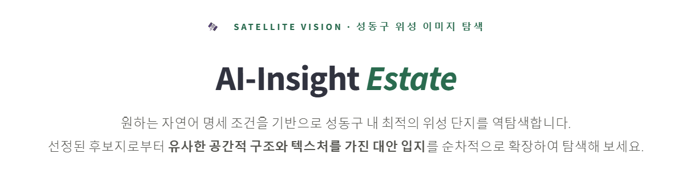
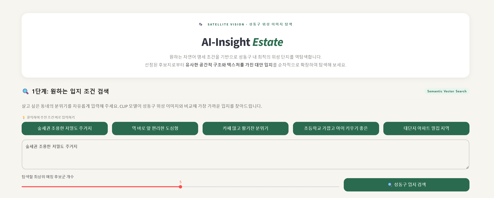
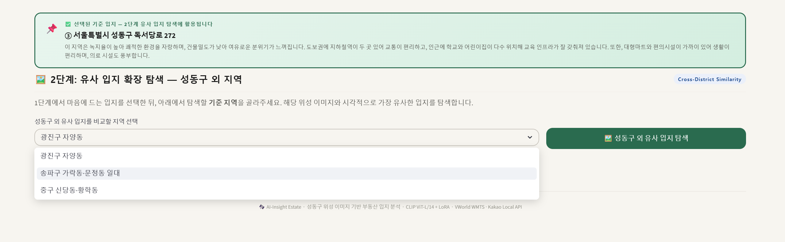
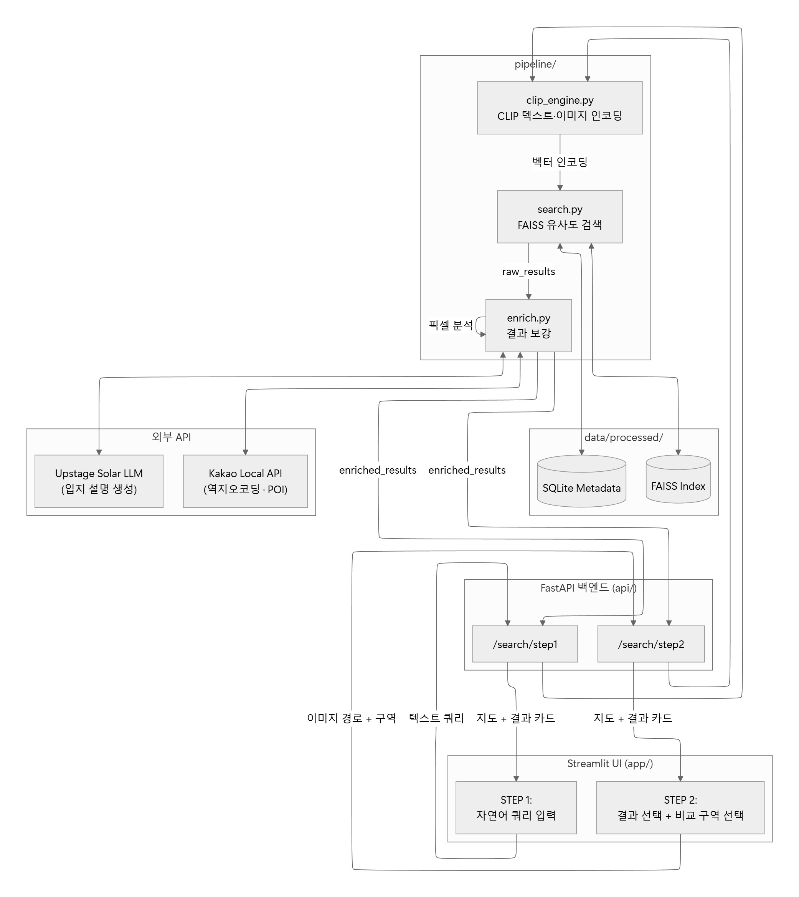
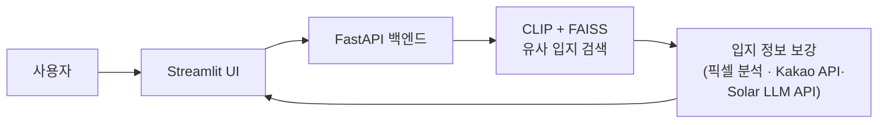

# AI-Insight Estate 🛰️
> 위성 이미지 분석 기반 맞춤형 부동산 입지 탐색 서비스

---

# 1. 프로젝트 소개
 
### 해결하고자 한 문제

기존 부동산 플랫폼(네이버 부동산, 직방 등)은 **키워드 필터** 기반 매물 검색에 한정되어 있습니다.
"나무가 많고 조용한 저밀도 주거지" 같은 **감성적·시각적 입지 조건**은 직접 방문 전까지 확인이 어렵고, 해당 입지를 설명하는 중개사의 설명 역시 주관적이라는 문제가 존재합니다.

### 핵심 기능
 
| 기능 | 설명 |
|---|---|
| **STEP 1 — 자연어 입지 검색** | "숲세권 저밀도 주거지" 같은 자연어를 입력하면 성동구 위성 이미지 중 가장 가까운 입지 Top-K를 반환 |
| **STEP 2 — 유사 입지 확장 탐색** | STEP 1에서 선택한 입지와 시각적으로 유사한 타 구역(광진구 자양동 / 송파구 가락·문정동 / 중구 신당·황학동) 입지 Top-3 추천 |
| **입지 설명 자동 생성** | 위성 이미지 픽셀 분석(녹지율·건물밀도) + 카카오 API 인프라 통계 + Solar LLM 기반 한국어 입지 설명문 자동 생성 |

---

## 2. 개발 환경 및 요구사항
 
### 환경
 
| 항목 | 버전 |
|---|---|
| Python | 3.12 |
| CUDA | 12.1 (GPU 추론용, CPU도 동작) |
| OS | Windows 10/11, Ubuntu 20.04 이상 |
 
### 주요 라이브러리

| 라이브러리 | 용도 |
|---|---|
| torch, torchvision, transformers | CLIP ViT-L/14 모델 추론 및 LoRA 파인튜닝 |
| faiss-cpu | 벡터 유사도 검색 인덱스 |
| fastapi, uvicorn | 백엔드 API 서버 |
| streamlit, streamlit-folium, folium | 프론트엔드 UI 및 지도 시각화 |
| requests, python-dotenv | Kakao / Upstage Solar API 연동 및 환경변수 관리 |
| numpy, pandas, pillow | 임베딩 연산, 메타데이터 처리, 이미지 처리 |

---
 
## 3. 설치 및 실행 방법

[ -- 기입 예정 -- ]

 
---
 
## 4. 시스템 아키텍처 / 데이터 파이프라인
 
### 전체 파이프라인 구조

**간단 구조**

### 기술 스택

**Web & Backend**

**AI / ML & Vector DB**

**Data & Database**

**External APIs**

**Management & Collaboration**

---
 
## 5. 팀원 정보 및 역할 분담
 
| 이름 | 학번 | 주요 담당 |
|---|---|---|
| 이지원 | 20230976 | 데이터 수집 및 전처리, 입지 설명 데이터셋 구축, CLIP ViT-L/14 LoRA 파인튜닝 |
| 김지은 | 20230980 | 데이터 수집 및 전처리, Streamlit UI, FAISS 인덱스 구축, FastAPI 백엔드 |
